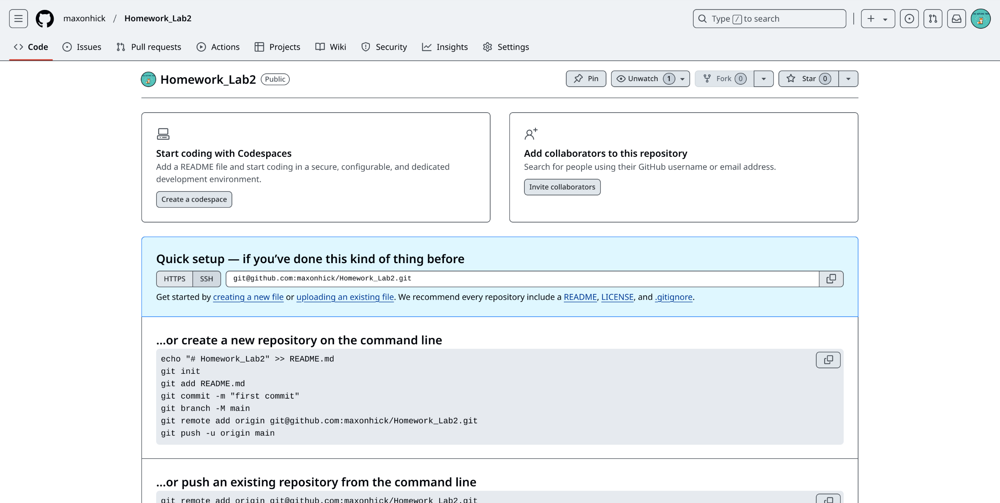

# Homework_Lab2  
##Part I  
1. Создайте пустой репозиторий на сервисе github.com (или gitlab.com, или bitbucket.com).  
\
[Ссылка на репозиторий](https://github.com/maxonhick/Homework_Lab2.git)
2. Выполните инструкцию по созданию первого коммита на странице репозитория, созданного на предыдещем шаге.\

3. Создайте файл ```hello_world.cpp``` в локальной копии репозитория (который должен был появиться на шаге 2). Реализуйте программу **Hello world** на языке C++ используя плохой стиль кода. Например, после заголовочных файлов вставьте строку ```using namespace std;```.\
```sh
vim hello_world.cpp
```
Откроется редактор файлов, в котором будет написана нужная программа.
4. Добавьте этот файл в локальную копию репозитория.\
```git add .```
5. Закоммитьте изменения с осмысленным сообщением.\
```git commit -m "add first program(hello_world.cpp)"```
6. Изменитьте исходный код так, чтобы программа через стандартный поток ввода запрашивалось имя пользователя. А в стандартный поток вывода печаталось сообщение ```Hello world from @name```, где ```@name``` имя пользователя.
7. Закоммитьте новую версию программы. Почему не надо добавлять файл повторно git add?
8. Запуште изменения в удалёный репозиторий.
9. Проверьте, что история коммитов доступна в удалёный репозитории.
