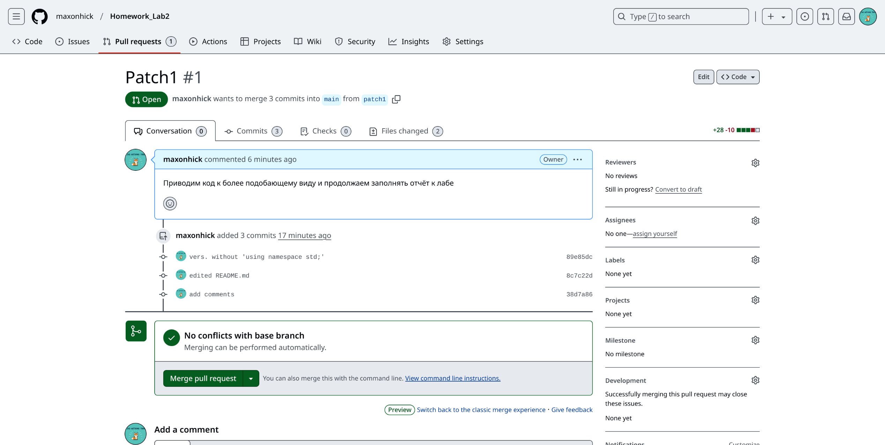

# Homework_Lab2
<details>
<summary>Part I</summary>

1. Создайте пустой репозиторий на сервисе github.com (или gitlab.com, или bitbucket.com).  
\
[Ссылка на репозиторий](https://github.com/maxonhick/Homework_Lab2.git)
2. Выполните инструкцию по созданию первого коммита на странице репозитория, созданного на предыдещем шаге.\

3. Создайте файл ```hello_world.cpp``` в локальной копии репозитория (который должен был появиться на шаге 2). Реализуйте программу **Hello world** на языке C++ используя плохой стиль кода. Например, после заголовочных файлов вставьте строку ```using namespace std;```.
```sh
vim hello_world.cpp
```
Откроется редактор файлов, в котором будет написана нужная программа.\
4. Добавьте этот файл в локальную копию репозитория.\
```git add .```\
5. Закоммитьте изменения с осмысленным сообщением.\
```git commit -m "add first program(hello_world.cpp)"```
```sh
[main 2c72ddc] add first program(hello_world.cpp)
 4 files changed, 26 insertions(+), 1 deletion(-)
 create mode 100644 git_init.png
 create mode 100644 hello_world.cpp
 create mode 100644 instruction.png
```
6. Изменитьте исходный код так, чтобы программа через стандартный поток ввода запрашивалось имя пользователя. А в стандартный поток вывода печаталось сообщение ```Hello world from @name```, где ```@name``` имя пользователя.\
Просто добавили пару строк кода, сомневаюсь, что есть что-то интересное.
7. Закоммитьте новую версию программы. Почему не надо добавлять файл повторно git add?\
```git commit -m "modified hello_world.cpp"```
8. Запуште изменения в удалёный репозиторий.\
```git push```
9. Проверьте, что история коммитов доступна в удалёный репозитории.\

</details>
<details>
<summary>Part II</summary>

1. В локальной копии репозитория создайте локальную ветку ```patch1```.\
```git branch patch1```
2. Внесите изменения в ветке ```patch1``` по исправлению кода и избавления от ```using namespace std;```.\
Перейдём в ветку ```patch1```: ```git checkout patch1```\
Изменим файл также через vim.
3. **commit, push** локальную ветку в удалённый репозиторий.
```sh
git commit -am "vers. without 'using namespace std;'"
git push --set-upstream lab2 patch1
```
4. Проверьте, что ветка ```patch1``` доступна в удалёный репозитории.

5. Создайте pull-request ```patch1 -> master```.
Для этого на самой странице репозитория надо нажать кнопку ```Compare && pull request```. (сомневаюсь, что нужны лишнее скрины)
6. В локальной копии в ветке ```patch1``` добавьте в исходный код комментарии.\
Всё такжечерез vim добавим комментарии.
7. **commit, push** Комментарии тут уже не нужны, это стало обычным делом.
8. Проверьте, что новые изменения есть в созданном на **шаге 5** pull-request.\

9. В удалённый репозитории выполните слияние PR ```patch1 -> master``` и удалите ветку ```patch1``` в удаленном репозитории.\
Это всё делает в интерфейсе GitHub, достаточно интуитивно, не очень хочесят захламлять отчёт фотографиями, поэтому можно будет просто посмотреть результат.

10. Локально выполните **pull**.\
```git checkout main``` - перейдёи в основную ветку\
```git pull``` - получим все изменения
11. С помощью команды **git log** просмотрите историю в локальной версии ветки ```master```.
<details>
<summary>Вывод команды:</summary>

```sh
commit 72012459e792add24636b222d1a0586cb47e05f2
Merge: da54121 908394e
Author: maxonhick <92450249+maxonhick@users.noreply.github.com>
Date:   Sun Mar 2 13:56:44 2025 +0300

    Merge pull request #1 from maxonhick/patch1
    
    Выполнение пункта 9 в домашнем задании.

commit 908394eebe55543fbf53d6559a93c795a3f31d62
Author: maxonhick <max2007varlamov@gmail.com>
Date:   Sun Mar 2 13:54:22 2025 +0300

    final commit before merge

commit 38d7a86bed04b2de188636abded0fc6fca85c8b3
Author: maxonhick <max2007varlamov@gmail.com>
Date:   Sun Mar 2 13:45:03 2025 +0300

    add comments

commit 8c7c22d76be96828f7fb8a02d0a9b0d5edcb9d79
Author: maxonhick <max2007varlamov@gmail.com>
Date:   Sun Mar 2 13:39:41 2025 +0300

    edited README.md

commit 89e85dc5575729d8073f6bd3eb360f81d3efb3a2
Author: maxonhick <max2007varlamov@gmail.com>
Date:   Sun Mar 2 13:29:06 2025 +0300

    vers. without 'using namespace std;'

commit da5412143bcad1ee8465e14cc822221f806b876b
Author: maxonhick <max2007varlamov@gmail.com>
Date:   Sun Mar 2 11:31:58 2025 +0300

    Correct Part I

commit da74c29b585d4b5c51b6ba0367ded76668f9f844
Author: maxonhick <max2007varlamov@gmail.com>
Date:   Sun Mar 2 11:29:33 2025 +0300

    final PartI

commit 985ab97f634c6a9d923989f47f702cf980edda87
Author: maxonhick <max2007varlamov@gmail.com>
Date:   Sun Mar 2 11:19:18 2025 +0300

    modified hello_world.cpp

commit 2c72ddc1a65e0600bb19ad70342de146ee3f01a4
Author: maxonhick <max2007varlamov@gmail.com>
Date:   Sun Mar 2 11:06:31 2025 +0300

    add first program(hello_world.cpp)

commit da46413998898b2ad91c854f9febe5fd324854f6
Author: maxonhick <max2007varlamov@gmail.com>
Date:   Sun Mar 2 10:43:30 2025 +0300

    first commit
```
</details>

12. Удалите локальную ветку ```patch1```.\
```git branch -d patch1``` - удаляем локально ветку ```patch1```\
```git fetch --prune``` - удаляем информацию об удалённой ветке
</details>
<details>
<summary>Part III</summary>

1. Создайте новую локальную ветку ```patch2```.
```sh
git branch patch2 // Содание новой ветки
git checkout patch2 // Переход в новую ветку
```
2. Измените code style с помощью утилиты clang-format. Например, используя опцию ```-style=Mozilla```.\
```clang-format -style=Mozilla -i hello_world.cpp``` - изменили формат
3. **commit, push**, создайте pull-request ```patch2 -> master```.
```sh
git commit -am "chenged style 'hello_world.cpp'"
git push --set-upstream lab2 patch2
```
pull-request так же содаётся через сайт Git-Hub
4. В ветке master в удаленном репозитории измените комментарии, например, расставьте знаки препинания, переведите комментарии на другой язык.\
Выполняется через сайт, скрины излишни, выполнение пункта можно посмотреть в истории commit'ов репозитория.
5. Убедитесь, что в pull-request появились конфликтны.

6. Для этого локально выполните **pull + rebase** (точную последовательность команд, следует узнать самостоятельно). **Исправьте конфликты.**
```sh
git pul --rebase lab2 main
```
</details>
